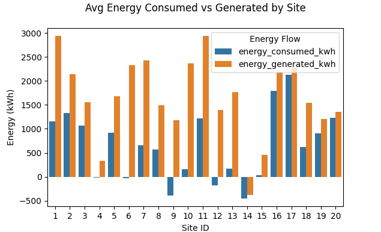

# See info.md for Design Decisions

---

# How To run

## Set up Parts 1-3 in AWS (lambda Functions, and DynamoDB)
The included terraform files will allow you to 1) simulate the site data Feed, 2) process the data feed data from S3 3) create the dynamo db it will be placed in
```
cd tf
terraform init
terraform plan # check to make sure 13 number of resources are being made
terraform apply
```

## API
First, install the required python packages, by setting up a local python environment
```
python -m venv venv
.\venv\Scripts\Activate.ps1 # source venv/bin/activate on unix
python -m pip install -r requirements.txt
```

I ran the API on python 3.10.11 on a Windows machine with Powershell
```
cd api
flask run
```

## Visualization
Use the same python environment / requirements file.
```
cd visualization
python visualization.py
```



# Other things
* I initially attempted to blindly query the API dynamodb requires that numbers be stored as a decimal. however boto3's dynambodb.table.query function doesn't know how to handle Decimals. I found a package online to address this issue
    * In order to convert decimal to float, There's an extra O(N) iteration through the entire output of the API. This may not be ideal if this data needs to appear somewhere quickly

# if I had more time
* annotate the API code endpoints with swagger yaml format info about the API - and creae an endpoint where the swagger documentation could autogenerate
* 


